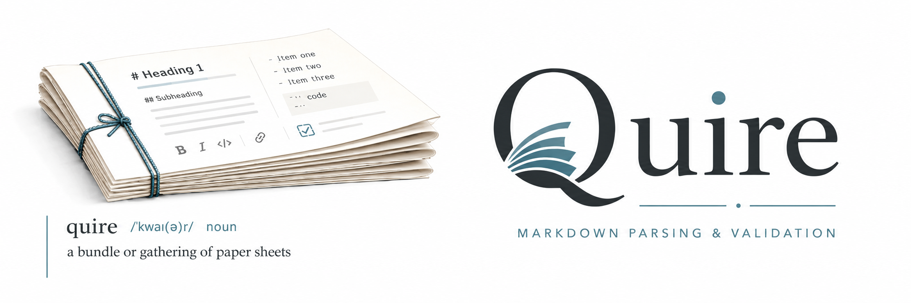

<p align="center">
  
</p>

# quire-rs

[](https://discord.gg/6qsdhSPE)

High-performance Rust engine for the **Filament/Quire** documentation-standard ecosystem.

quire-rs turns plain Markdown into a validated, queryable, structured corpus. You define a
**doc standard** as a *module* — a set of *archetypes* (document types like `FR`, `NFR`,
`US`) backed by JSON Schemas and a declarative body-extraction DSL — and quire-rs parses,
validates, extracts, and edits documents against it.

Markdown is canonical: documents are authored and stored as plain `.md` files. The
render/templating feature was removed in v0.2 — quire-rs is a *parse → validate → extract*
engine, not a renderer. Schema is correctness; presentation lives outside the engine.

The engine is consumable three ways: as a **Rust crate**, as a **Python wheel** (PyO3),
and as **WebAssembly**.

## Features

**Parsing**
- `parse_document` → a `QuireDocument` AST: YAML frontmatter, a heading tree of
  `QuireSection`s, byte-exact content slices, and stable Pandoc `{#blk-id}` block IDs that
  survive edits (vs. the unstable line-based `id`).
- `extract_frontmatter` — BOM-stripping, CRLF-tolerant, forgiving YAML extraction (malformed
  frontmatter falls back to body, never errors).

**Query API** (read-only)
- `section` / `sections`, `parse_table` / `table_from_section`, `parse_bullet_list`,
  `extract_diagrams` (fenced code by language, e.g. `mermaid`), full-text `search`, and
  `concept_type` (read the routing discriminator). Regexes compiled once.

**Archetypes & module loading**
- `Registry` — an immutable, thread-safe (`Arc`) compiled index of archetypes loaded from
  module directories (`manifest.yaml` + `schemas/`).
- Filesystem-first discovery via `Registry::from_env` (`IX_FILAMENT_MODULES_PATH` →
  `IX_SCHEMA_PATH` → `~/.ix/filament/modules/`), explicit `load_from` / `load_module`, or
  in-memory `from_inline_parts` (for WASM). Tolerant vs. strict collision handling; load
  problems surface as diagnostics/failures rather than panics.

**Validation**
- `validate` / `validate_all` — JSON Schema (Draft 2020-12) validation of a data record
  against an archetype; `apply_patch` does merge-then-validate.
- `validate_document` / `validate_document_in_registry` — end-to-end Markdown validation:
  concept shape → frontmatter schema → required body-extraction asserts → per-level heading
  uniqueness. Composed `type` + `object` validation (unknown `object:` is a warning, never
  an error). Structured `ValidationResult { is_valid, errors, warnings }` with line numbers
  and machine-readable `ValidationReason` codes.

**Body-extraction DSL**
- `extract` evaluates a manifest's `body_extraction` DSL into records + edges. Six locator
  primitives (`frontmatter_field`, `section_body`, `code_block`, `table_row`, `list_item`,
  `heading`), fallback chains, single-yield (`match`) vs. multi-yield (`iterate_over` +
  `per_match`), an `assert` facet with `{field}` interpolation, and edge emission.

**Editing (writeback)**
- `update_section` / `update_block` — byte-splice a single section or block and return the
  full updated Markdown; everything else stays byte-identical. No reserialization.

**Authoring contracts**
- `input_contract_for` derives a per-archetype input contract (JSON for tools) plus a
  Markdown authoring skeleton from the schemas + body-extraction asserts.

**Corpus**
- `load_repo` / `load_repo_with` — parallel, gitignore-aware directory walk (rayon, no shared
  mutable state) into `LoadedDocument`s.
- `Spec` — an immutable in-memory corpus with `by_id` lookup and intra-spec reference
  resolution; `harvest_edges`, `validate_bundle` (strict vs. permissive posture), and
  `unlinked_references` (dangling-edge detection + autofix suggestions). Identity is read,
  never derived: `id` is the human artifact id, `uuid` is the durable UUID7 from frontmatter.

**Lint**
- `lint_document` — declarative, advisory lint rules (`table_column_values`,
  `section_body_pattern`) declared in the manifest. Lint never blocks validation.

**Diagnostics & errors**
- `QuireError` (typed, `thiserror`-derived) and `format_violation` for actionable messages
  with field paths and observed-value previews; non-fatal `Diagnostic`s for load/walk issues.

**Bindings**
- **Python** (`--features python`): a maturin-built `quire` wheel exposing `parse_document`,
  `load_repo`, `validate`, `validate_document`, `extract`, `extract_frontmatter`,
  `harvest_edges`, `input_contract`, `input_skeleton`, `validate_manifest`, plus `Spec`,
  `Registry`, and `ExtractionContext` classes and a `QuireBaseError` exception hierarchy.
  The GIL is released on heavy Rust work; first-party binding code is `unsafe`-free.
- **WASM** (`--features wasm`): a filesystem-free `wasm32` build using in-memory schemas via
  `Registry::from_inline_parts` (`resolve-file` is disabled).

**Hardening**
- `#![forbid(unsafe_code)]` by default (no first-party `unsafe`), determinism gates
  (`BTreeMap`/`IndexMap` over `HashMap`, proptest, loom), criterion perf-regression gates,
  cargo-fuzz targets, and `cargo-deny` license/source allowlists. MSRV 1.75.

## Install & use

**Rust crate** — add it as a dependency:

```toml
[dependencies]
quire = { git = "https://github.com/agent-ix/quire-rs" }
```

Feature flags:

| Feature        | Default | Effect                                                            |
| -------------- | :-----: | ----------------------------------------------------------------- |
| `resolve-file` |   ✅    | Filesystem `$ref`/schema resolution (via the `jsonschema` crate). |
| `python`       |   ❌    | PyO3 bindings → the `quire` Python wheel.                         |
| `wasm`         |   ❌    | `wasm32` build; disables `resolve-file`, schemas passed in-memory.|

**Python wheel** (`quire`):

```bash
pip install quire   # from the internal pypi.ix index
```

**WASM** — consume via the [`quire-wasm`](#related-projects) npm package, or build with
`--features wasm` and `Registry::from_inline_parts`.

## Quick start

Rust — validate a Markdown document against a module loaded from the environment:

```rust
use quire::Registry;

let registry = Registry::from_env()?;
let archetype = registry.archetype("FR").expect("FR archetype loaded");

let doc = std::fs::read_to_string("spec/FR-001.md")?;
let result = quire::validate_document_in_registry(&registry, archetype, &doc);

if !result.is_valid {
    for e in &result.errors {
        eprintln!("{}: {}", e.line.unwrap_or(0), e.message);
    }
}
```

Python:

```python
import quire

result = quire.validate_document("FR", "~/.ix/filament/modules/spec-artifacts-iso", doc_text)
print(result["errors"], result["warnings"])
```

## Usage guide

See **[docs/USAGE.md](docs/USAGE.md)** for the full guide to authoring a doc standard:
archetypes, modules, manifests, schemas, the body-extraction DSL, document/block structure,
validation flow, lint rules, input contracts, the corpus, and per-surface (Rust/Python/WASM)
usage with an end-to-end worked example.

## Development

```bash
make ci            # fmt-check + lint + test + deny + audit-unsafe (full gate)
make test          # cargo test
make lint          # clippy with -D warnings
make fmt           # rustfmt
make build         # release build
make deny          # cargo-deny license/source check
make audit-unsafe  # every `unsafe` block has a // SAFETY: comment
```

MSRV is **1.75** (pinned in `clippy.toml` / `rust-toolchain.toml`). See `CLAUDE.md` for the
safety scaffolding and design conventions, and `spec/` for the normative requirements.

## Related projects

| Project              | Relationship to quire-rs                                                          | Published as            |
| -------------------- | --------------------------------------------------------------------------------- | ----------------------- |
| `quire` (TypeScript) | Reference implementation; quire-rs ports it and maintains parity.                 | `@agent-ix/quire` (npm) |
| `quire-cli`          | Thin command-line wrapper over the engine (parse / extract / lookup / edit / validate). | `@agent-ix/quire-cli`   |
| `quire-wasm`         | WebAssembly bindings bringing parse / extract / validate to browser & Node.       | `@agent-ix/quire-wasm`  |
| `spec-artifacts-iso` | An archetype **module** (FR / NFR / StR / US / IT / TC / AC / CON) consumed by the engine. | `spec_artifacts_iso` (pypi.ix) |
| `quoin`            | Spec-domain CLI; installs modules and provides agent authoring contracts.         | `@agent-ix/quoin`     |

## License

MIT
