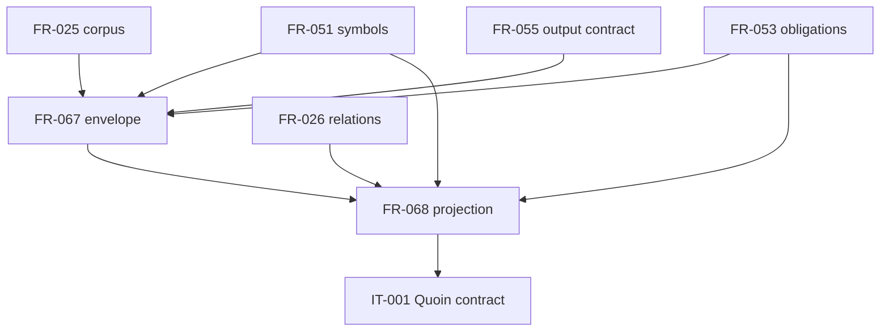

## Summary

The dependency graph is acyclic. Existing corpus, obligation, schema, and symbol surfaces enable the new v1 envelope; the projection then enables the cross-repository Quoin contract.

## Findings

| ID | Severity | Summary | Refs |
| --- | --- | --- | --- |
| FND-001 | low | No open dependency issues | - |

## Classification

| Requirement | Class | Rationale |
| --- | --- | --- |
| StR-007 | Feature | States the reviewer-visible source-grounding need |
| FR-067 | Enablement | Defines the stable envelope, schema, premise inventory, and reader boundary |
| FR-068 | Feature | Projects the authoritative records used by assurance consumers |

## Dependency Graph

Topological order: existing prerequisites, FR-067, FR-068, then IT-001. No cycles were detected.
