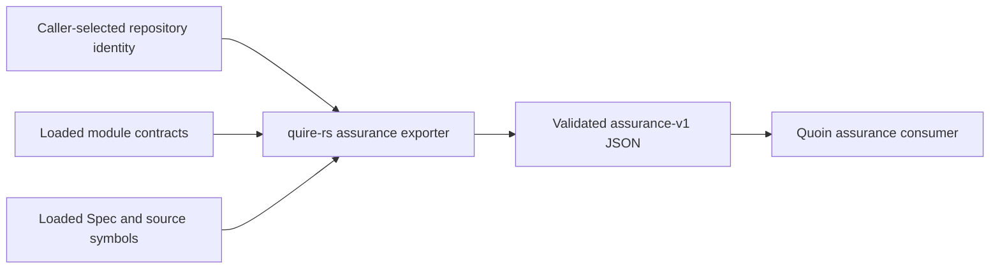

## Summary

Responsibilities are explicitly divided: quire-rs owns authoritative projection and contract validation, callers own immutable repository selection, modules own vocabulary and applicability, and Quoin owns freshness and sufficiency verdicts.

## Findings

| ID | Severity | Summary | Refs |
| --- | --- | --- | --- |
| FND-001 | low | No open scope or ownership issues | - |

## System Boundary

## External Dependencies

| Dependency | Type | Assumed or Guaranteed | Contract |
| --- | --- | --- | --- |
| Caller repository identity | immutable input | assumed, syntax validated | FR-067 source premise |
| Module manifests and schemas | loaded in-process data | guaranteed before export | Registry load contract + schema digests |
| Quoin consumer | offline downstream | guaranteed by contract test | IT-001 |

## Responsibility Allocation

| Requirement | Owning Component | Class |
| --- | --- | --- |
| StR-007 | quire-rs assurance boundary | core |
| FR-067 | `assurance` contract module | infrastructure |
| FR-068 | `assurance` projection module | core |

Git lookup, network access, persistence, and assurance verdicts are out of scope.
