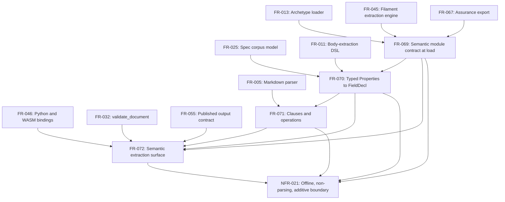

# SR-071: Dependency review of the semantic extraction boundary slice

## Summary

Examined the prerequisite edges, enablement/feature split, and acyclicity of
US-019, FR-069..FR-072, NFR-021 and matrix rows TC-1599..TC-1644 for
`agent-ix/quire-rs#388`, and checked each external prerequisite the slice
names against the record on 2026-09-03. The in-repo graph is a single chain
(FR-069 → FR-070 → FR-071 → FR-072, NFR-021 constraining all four) with no
cycle. The three upstream contracts the slice vendors are merged on `main`
(`agent-ix/quoin` 3e842ce, `agent-ix/filament-core-data` d48b8da,
`agent-ix/filament-core-service` a77f31e). The record differs from the plan in
six places: the WASM binding repo pins `quire-rs` to a branch that no longer
exists and has no ticket for `extractSemantic` (FND-340); FR-069 cites a
semantic-core bundle path that does not exist at the pinned revision
(FND-341); the `filament-parser-lib#8` stability precondition is open and
itself depends on the open `quire-rs#10` (FND-342); one citation is ambiguous
and two edge sets disagree (FND-343, FND-344, FND-346); and the WASM
verification rows have no runner in this repo (FND-345). Verdict: the slice is
sequenceable as specified; FND-340 and FND-341 need a correction before
`spec-to-plan` consumes the graph.

## Findings

| ID | Severity | Summary | Refs |
| ------- | -------- | -------------------------------- | ------ |
| FND-340 | high | `agent-ix/quire-wasm` (`Cargo.toml` line 21) pins `quire-rs` by `branch = "task-9-10-canonical-filament-extraction"`, which no longer exists on `origin` (`git ls-remote` returns nothing), and the quire-wasm issue list is empty. FR-072 requires the WASM binding to expose `extractSemantic` and TC-1636/TC-1644 (P0) assert Rust/WASM parity, so a re-pin and a binding change in a second repo are prerequisites of FR-072-AC-6 and NFR-021-AC-4 that no artifact in the slice or the ticket records. | FR-072-AC-6, NFR-021-AC-4, TC-1636, TC-1644 |
| FND-341 | medium | FR-069 Inputs vendor the semantic-core bundle from `agent-ix/filament-core-data` `packages/semantic-core/schemas/` with the digest "recorded from its `toolchain.json`". At revision d48b8da that directory does not exist: the emitted bundle is `packages/semantic-core/generated/json-schema/*.json` and the digest file is `packages/semantic-core/generated/toolchain.json` (`digest: sha256:dd33c886…`, `base: https://schemas.agent-ix.org/semantic-core/0.1.0/`). TC-1606 and FR-069-CON-2 pin provenance to the stated path, so the path in the requirement must be corrected before the vendoring task is written. | FR-069, FR-069-AC-8, FR-069-CON-2, TC-1606 |
| FND-342 | medium | The ticket states `agent-ix/filament-parser-lib#8` "must be stable before changing its consumed boundary". In the record #8 is OPEN with a single comment, "Depends on agent-ix/quire-rs#10", and quire-rs#10 ("Expose canonical Filament extraction through PyO3 and WASM") is also OPEN although FR-046 is marked shipped (TC-686 passing). FR-072 lists #8 as downstream. The precondition is therefore unmet in the record and cannot become met inside this slice; FR-072-CON-1 and NFR-021-AC-3 make every addition optional, so the boundary #8 consumes (`extract_filament_core`) is byte-unchanged and the ordering constraint has no technical content. Report only; no gate is introduced here. | FR-072, FR-072-CON-1, NFR-021-AC-3 |
| FND-343 | low | FR-069 cites "`agent-ix/filament-core-service` FR-035 CR-003" for the `semantic` block. FR-035 on `origin/main` (a77f31e) carries two entries labelled CR-003: the 2026-06-20 FR-040 edge-vocabulary change and the 2026-09-03 semantic-block change (FR-035-AC-13..15). The citation is ambiguous; the duplicate id is an upstream defect, and the quire-rs reference should name FR-035-AC-13..15 or the date. | FR-069 |
| FND-344 | low | Frontmatter `requires` edges are a strict subset of the prose Dependencies: FR-070 omits FR-025 and FR-011; FR-071 omits FR-005; FR-072 omits FR-069, FR-070, FR-071 and FR-055 although its Description exposes "the FR-070/FR-071 extraction". A DAG built from the machine-readable relationships places FR-072 beside FR-070 instead of after FR-071. The prose graph below is the one used here. | FR-070, FR-071, FR-072 |
| FND-345 | medium | TC-1636 (WASM parity) and TC-1642 (`wasm` feature build with the embedded bundle) are P0 but this repo has no WASM target in `Makefile` or `.github/workflows/ci.yml`; the existing WASM rows already carry external status (TC-687 "downstream `@agent-ix/quire-wasm`", TC-689 "CI wasm-target", TC-767 "external, CR-058"). The new rows do not say where their evidence lives, so `spec-to-plan` cannot allocate them to a repo or a gate. | TC-1636, TC-1642, NFR-021-AC-2, NFR-021-AC-4 |
| FND-346 | low | FR-069 Behavior says the `(package, object type, schema digest)` tuple "SHALL be the one the assurance export lists" under FR-067-AC-3, but FR-067-AC-3 lists `(module, archetype, schema_digest)`. `package` (`<org>/<repo>`) is not the module name and an object type is not an archetype, so the identity claim between the two tuples is not literally satisfiable as written; the edge FR-067 → FR-069 is real but the shared key needs one vocabulary. | FR-069, FR-067-AC-3 |

## Classification

| Requirement | Class | Rationale |
|-------------|-------|-----------|
| US-019 | Feature | The frontend-visible story; realized by FR-069..FR-072. |
| FR-069 | Enablement | Vendors the module-manifest schema and the semantic-core bundle, adds the `SemanticModule` record and reference-form `data_schema` resolution to the loader (FR-013) and to `Registry::from_inline_parts`. No declaration is extracted; the repo today vendors neither schema (no `semantic-core` or `module-manifest` reference under `src/`, `schemas/`, `Cargo.toml`). |
| FR-070 | Feature | Produces `fields[]` from the typed table or `sysml` fence with row loci; consumer-visible, and the cell grammars are reused by FR-071 parameter tables. |
| FR-071 | Feature | Produces `clauses[]`, `clauseText`, `operations[]` with spans; reuses FR-070 cell mapping for params and returns. |
| FR-072 | Feature | The single additive `semantic` record on library, `validate_document`, Filament API, Python and WASM surfaces, plus the hand-authored `semantic-v1` output schema. |
| NFR-021 | Enablement | Static boundary audit, contract byte-identity replay, and three-surface parity harness that every FR in the slice is measured against; it adds no behavior. |

External prerequisites (record checked 2026-09-03):

| Prerequisite | Needed by | State in record |
|--------------|-----------|-----------------|
| `agent-ix/quoin#293` (FR-070..FR-075, mapping fixtures at 3e842ce) | FR-069, FR-070, FR-071 | CLOSED; 3e842ce on `origin/main`; `tests/fixtures/semantic-module/{mapping,corpus,module-ok,vendored}` present. |
| `agent-ix/filament-core-data#35` (semantic-core 0.1.0 at d48b8da) | FR-069, FR-070, FR-071 | CLOSED; d48b8da is `origin/main`; bundle at `packages/semantic-core/generated/json-schema/` (see FND-341). |
| `agent-ix/filament-core-data#34` (IR v1.1 constraint vocabulary) | FR-070 | CLOSED. |
| `agent-ix/filament-core-service#22` (module-manifest `semantic` block, a77f31e) | FR-069 | MERGED; `semantic` block with inline `targets` enum on `origin/main`, so no separate target registry needs vendoring. |
| `agent-ix/quire-rs#386` (FR-067/FR-068 assurance export) | FR-069 | CLOSED (see FND-346 for the tuple vocabulary). |
| `agent-ix/quire-wasm` binding change and re-pin | FR-072-AC-6, NFR-021-AC-4 | Not recorded anywhere; pinned branch is gone (FND-340). |
| `agent-ix/filament-parser-lib#8` stable | ticket sequencing text | OPEN, depends on OPEN quire-rs#10 (FND-342). |

## Dependency Graph

Every edge above is an explicit `requires` relationship or an Upstream entry
in the reviewed artifacts; FR-013, FR-045, FR-067, FR-025, FR-011, FR-005,
FR-046, FR-032 and FR-055 are shipped and appear only as sources.

## Topological Order

1. FR-069 (enablement: vendored schemas with provenance, `SemanticModule`, reference-form `data_schema`; TC-1599..TC-1609). External step alongside it: correct the bundle path (FND-341) and record the quire-wasm re-pin (FND-340).
2. FR-070 (TC-1610..TC-1621).
3. FR-071 (TC-1622..TC-1629).
4. FR-072 (TC-1630..TC-1640); the WASM half of AC-6 lands in `agent-ix/quire-wasm` after step 1's re-pin.
5. NFR-021 verification rows (TC-1641..TC-1644) run last over the whole slice; the static audits in TC-1619, TC-1620, TC-1627, TC-1628 and TC-1640 can be authored at step 1 and kept green through steps 2–4.

No two FRs in the slice are parallelizable: each consumes the previous FR's
output type (`SemanticModule` → `FieldDecl[]` → `ClauseRef[]`/`OperationDecl[]`
→ `SemanticExtraction`).

## Cycles

None detected. FR-069 depends on FR-067 and FR-067's downstream is FR-068 only;
nothing in FR-069..FR-072 feeds back into FR-013, FR-045, FR-046 or FR-067.

## Dispositions (applied 2026-09-03, same branch, before Plan-003)

| ID | Disposition |
| --- | --- |
| FND-340 | Fixed — `agent-ix/quire-wasm#3` filed (re-pin, `extractSemantic`, CI parity); TC-1636/1644 reference it. |
| FND-341 | Fixed — real bundle path and digest recorded (FR-069 Inputs). |
| FND-342 | Accepted, recorded — filament-parser-lib#8 open; this slice keeps the consumed boundary byte-unchanged (FR-072-CON-1, AC-9); reported to the owner. |
| FND-343 | Fixed — cites FR-035-AC-13..15. |
| FND-344 | Fixed — `requires` edges added (FR-069→FR-067, FR-070→FR-011/FR-025, FR-071→FR-005, FR-072→FR-069/070/071/055). |
| FND-345 | Fixed — TC-1636 external with runner named; TC-1649 wasm compile check added to `make ci`. |
| FND-346 | Fixed — tuple named as FR-067-AC-3's `(module, archetype, schema_digest)`. |
