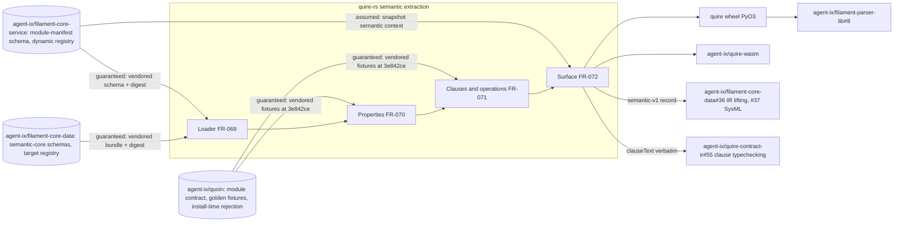

## Summary

The slice keeps Quire an extraction engine: the out-of-scope section names clause typechecking, IR lifting, SysML emission, package publishing, and corpus migration as compiler or Quoin concerns, and FR-070-CON-1, FR-071-CON-1, FR-072-CON-2, and NFR-021 guard each with a static test. Every requirement in the slice has one owner. Four medium findings remain: the vendored semantic-core provenance names a path that does not exist at the pinned revision, the ticket's `lossy` state is absent from the availability model, the ticket's first three deliverable bullets have no stated disposition in the slice, and the Filament snapshot `semantic` context is defined only on the consuming side.

## Findings

| ID | Severity | Summary | Refs |
| --- | --- | --- | --- |
| FND-400 | medium | FR-069 pins the semantic-core bundle at `agent-ix/filament-core-data` `packages/semantic-core/schemas/` (revision `d48b8da`); at that revision the emitted schemas live under `packages/semantic-core/generated/json-schema/` and the digest source is `packages/semantic-core/generated/toolchain.json`. FR-069-CON-2 and AC-8 (TC-1606) cannot be satisfied against the recorded path. | FR-069, TC-1606 |
| FND-401 | medium | The ticket's acceptance criterion lists `lossy` among the states that must stay distinguishable; the slice defines `available`, `not_applicable`, `missing`, `unavailable`, and per-entry `unresolved`/`unchecked`, and records `compatibility_posture` (`declared-lossy`) without any reading of it. The state is dropped without an out-of-scope statement. | FR-069, FR-072, US-019 |
| FND-402 | medium | The ticket's first three deliverables (build on #386 exports, map `QuireDocument`/graph nodes and edges/diagnostics/spans/availability to shared contracts, preserve bytes for lossless profiles) are read by the slice through the L3 addendum: diagnostics gain a `locus`, availability is per declaration kind, fence bytes are carried verbatim, and compatibility is byte-identity rather than adapters. Graph node/edge mapping to shared contracts and the #386 dependency are neither claimed nor declared deferred; the slice needs one explicit disposition line so the narrowing is a decision, not an omission. | US-019, FR-072, spec.md 2.2 |
| FND-403 | medium | FR-069 and FR-072 consume a `semantic` context on each Filament snapshot (`contractVersion`, `semanticCore`, `package`, `exports`, `imports`, resolved schema inline) and allocate its production to `agent-ix/filament-core-service` FR-035. FR-035 CR-003 on `origin/main` covers only the manifest schema; no core-service requirement or ticket defines the snapshot context or the reference-form resolution for the dynamic registry, so the producer side of this contract is unallocated. | FR-069, FR-072, FR-045 |
| FND-404 | low | FR-072 requires `extractSemantic` in `agent-ix/quire-wasm` and TC-1636 verifies it from this matrix, following the FR-046 precedent, but no quire-wasm ticket exists for the export. Name the receiving ticket so the cross-repo obligation has an owner. | FR-072, TC-1636 |
| FND-405 | low | The `semantic` block admits ten keys; the FR-069 `SemanticModule` record carries eight. `mappings` and `sweep_report` are accepted by schema and silently unused; state that both are Quoin install-time keys (quoin FR-074, FR-075) that Quire records or ignores. | FR-069 |
| FND-406 | low | FR-069 rejects a `target` outside "the vendored target registry" but its Inputs name only the module-manifest schema and the semantic-core bundle; the registry is `schema/semantic/v1/common.schema.json` in `agent-ix/filament-core-data`, a third vendored file without recorded provenance. | FR-069 |
| FND-407 | low | Quoin FR-070 allocates artifact-time reporting of an invalid `semantic` block to Quire as a document-level diagnostic; FR-069 instead fails the module load with `ArchetypeLoadFailure`, so artifacts of that type surface an unknown-type error rather than a `semantic.*` finding. The owner's expectation and the consumer's behaviour differ in form. | FR-069, quoin FR-070 |

## System Context

## In-Scope Responsibilities

- Load a module's `semantic` block and reference-form `data_schema` offline, refusing unsupported versions, digests, and references explicitly (FR-069).
- Extract typed `## Properties` (table or `sysml` fence) to `FieldDecl[]`, resolving type tokens to identities or `unresolved/` placeholders with advisory findings (FR-070).
- Extract `## Invariants` and `## Operations` to `ClauseRef[]` and `OperationDecl[]` with spans, carrying fence bodies as opaque bytes (FR-071).
- Expose one additive `semantic` record with explicit availability across library, `validate_document`, Filament API, Python, and WASM, under a hand-authored `semantic-v1` schema (FR-072).
- Keep every pre-existing contract byte-identical and the crate graph free of clause parsers, renderers, network, and persistence (NFR-021).

## Out of Scope (explicit in the slice)

- Clause typechecking and evaluation: `agent-ix/quire-contract-ir#55` (spec.md 2.2, FR-071-CON-1, NFR-021-AC-1).
- IR lifting and SysML v2 emission: `agent-ix/filament-core-data#36`, `#37` (spec.md 2.2, US-019 Constraints).
- Package publishing and manifest derivation: compiler and quoin FR-075 (spec.md 2.2).
- Corpus migration: legacy forms are reported with `migration: typed-table`, never rewritten (spec.md 2.2, FR-070; quoin FR-074 owns the sweep).
- Rendering, code generation, file writes: FR-072-CON-2, TC-1640.
- Install-time rejection of a `semantic` block: quoin FR-070; Quire repeats the checks at load time (see FND-407).
- Resolving reference-form `data_schema` for the dynamic registry: `agent-ix/filament-core-service` (FR-069, `semantic.data-schema-unresolved-reference`; see FND-403).

## External Dependencies

| Dependency | Type | Assumed or Guaranteed | Contract |
| --- | --- | --- | --- |
| Module-manifest schema (`filament-core-service` `a77f31e`) | vendored JSON Schema | Guaranteed | FR-069-CON-2, TC-1606 provenance digest |
| Semantic-core schema bundle (`filament-core-data` `d48b8da`) | vendored JSON Schema | Guaranteed | FR-069-AC-8, TC-1606 against `toolchain.json` (path wrong, FND-400) |
| Target registry (`filament-core-data` `common.schema.json`) | vendored JSON Schema | Assumed | none recorded (FND-406) |
| Golden mapping fixtures (`quoin` `3e842ce`) | vendored read-only fixtures | Guaranteed | FR-070-AC-1..8, FR-071-AC-1..4 |
| Filament snapshot `semantic` context | caller-supplied data | Assumed | FR-045-CON-2; no producer requirement (FND-403) |
| `agent-ix/quire-wasm` `extractSemantic` | downstream binding | Guaranteed | FR-072-AC-6, TC-1636 (no receiving ticket, FND-404) |
| `agent-ix/filament-parser-lib#8` shim | downstream consumer | Assumed additive | FR-072-CON-1 byte-identity without context |
| `agent-ix/filament-core-data#36` worked example | downstream consumer | Assumed | ticket AC-5 satisfied via quoin golden, not #36 directly |

## Responsibility Allocation

| Requirement | Owning Component | Class |
| --- | --- | --- |
| US-019 | quire-rs semantic extraction | core |
| FR-069 | archetype loader (`semantic` module) | infrastructure |
| FR-070 | semantic extraction module | core |
| FR-071 | semantic extraction module | core |
| FR-072 | extraction surface and bindings | cross-cutting |
| NFR-021 | crate boundary (static audits) | cross-cutting |

No requirement is shared between two components; the obligations Quire hands off (typechecking, lifting, emission, publishing, migration, install-time rejection, registry resolution) each name their owner, with the producer gaps recorded in FND-403 and FND-404.

## Dispositions (applied 2026-09-03, same branch, before Plan-003)

| ID | Disposition |
| --- | --- |
| FND-400 | Fixed — path and digest corrected. |
| FND-401 | Fixed — per-kind `lossy` boolean; `compatibility_posture: declared-lossy` read (FR-072-AC-2). |
| FND-402 | Fixed — disposition paragraph in FR-072 Description. |
| FND-403 | Fixed — `agent-ix/filament-core-service#23` filed as producer. |
| FND-404 | Fixed — `agent-ix/quire-wasm#3` filed. |
| FND-405 | Fixed — accepted-and-ignored keys stated. |
| FND-406 | Fixed — registry vendored with provenance. |
| FND-407 | Accepted, recorded — see SR-070 FND-323. |
