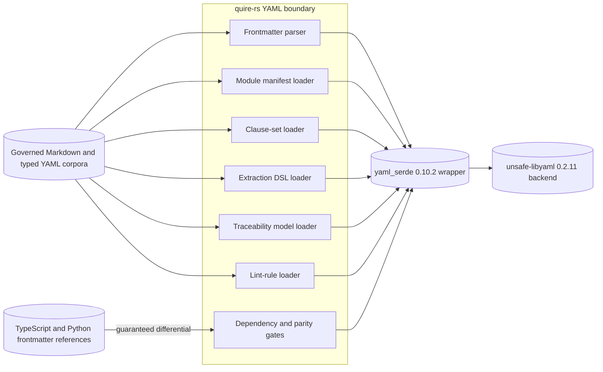

## Summary

The decision correctly keeps the migration inside `quire-rs` and preserves the
public import surface, but its enumerated parse surface is incomplete and its
external dependency guarantees are implicit. The missing production consumers
must be included in parity evidence before the package boundary can change.

## Findings

| ID | Severity | Summary | Refs | Escape Cause |
| --- | --- | --- | --- | --- |
| FND-433 | high | ADR-0012 names frontmatter, module manifests, clause sets and extraction DSL data, but production code also parses or serializes traceability models and lint rules through `serde_yaml`. Omitting those consumers permits a zero frontmatter differential while another first-party behavior changes. | ADR-0012 (Context, Required implementation evidence); src/traceability.rs; src/lint.rs | missing-requirement |
| FND-434 | medium | The boundary does not classify the selected `yaml_serde` wrapper and inherited `unsafe-libyaml` backend, the TypeScript/Python reference parsers, or the governed corpora as assumed versus guaranteed dependencies with named contracts. In particular, organizational maintenance is an external assumption, while exact package bytes, advisory/license posture and observed parser parity are guarantees this repository must verify. | ADR-0012 (Decision drivers, Consequences); AP-201 (Tool Reliance and Independence) | missing-requirement |
| FND-435 | medium | The unchanged import alias intentionally makes the migration repository-wide, including test/corpus loaders that expose `serde_yaml::Value`; the ADR does not distinguish production compatibility obligations from test-harness adaptation. Without that boundary, fixture-loader changes could be mistaken for product parity evidence or silently narrow the corpus. | ADR-0012 (Decision); tests/corpus_case; tests/corpus_cases.rs | missing-requirement |

## System Context

## In-Scope Responsibilities

- Select and exactly pin the maintained package behind the existing Rust import
  name without changing public or internal call sites unnecessarily.
- Preserve parse outcome and value semantics for every production YAML consumer,
  including frontmatter, manifests, clauses, extraction DSL, traceability models
  and lint rules.
- Preserve TypeScript/Python frontmatter compatibility and the governed corpus
  population.
- Reject deprecated/wrong package resolution, wrong versions, incompatible MSRV,
  advisories, denied licenses and every observed semantic differential.
- Retain exact producer, corpus, module and result provenance for the decision.

## Out of Scope

- Raising the quire-rs MSRV above Rust 1.75.
- Redesigning YAML call sites, public data types or frontmatter semantics.
- Replacing the inherited libyaml backend with a pure-Rust parser.
- Changing TypeScript or Python reference behavior.
- Treating test-only corpus-loader adaptation as proof of production parity.

## External Dependencies

| Dependency | Type | Assumed or Guaranteed | Contract |
| --- | --- | --- | --- |
| `yaml_serde` project maintenance | upstream governance | Assumed | ADR-0012 revisit trigger for archive/security-fix viability |
| `yaml_serde` 0.10.2 package bytes and MSRV | Cargo dependency | Guaranteed | exact Cargo pin/tree plus Rust 1.75 build |
| `unsafe-libyaml` 0.2.11 | transitive parser backend | Guaranteed for selected resolution and advisory/license posture; parser correctness tested differentially | Cargo tree, cargo-deny/audit, differential suite |
| TypeScript/Python frontmatter parsers | external reference implementations | Guaranteed for the governed compatibility cases | existing cross-language parity suite |
| Markdown and typed YAML corpora | versioned test inputs | Guaranteed for enumerated population and exact bytes | retained manifest/digests and AP-201 provenance |

## Responsibility Allocation

| Requirement or decision | Owning Component | Class |
| --- | --- | --- |
| ADR-0012 | quire-rs dependency boundary | infrastructure |
| NFR-009 | quire-rs static dependency policy | cross-cutting |
| FR-006 compatibility consumed by the decision | quire-rs frontmatter parser | core |
| FR-013 compatibility consumed by the decision | quire-rs module loader | infrastructure |

The Rust package migration and its audits remain owned by `quire-rs`; upstream
projects supply dependencies and reference behavior but do not accept or retain
Quire's compatibility evidence.

## Dispositions after specification amendment

| ID | Disposition |
| --- | --- |
| FND-433 | Fixed in the candidate specification: ADR-0012 and NFR-009 now include traceability-model and lint-rule parse/serialization behavior in the production compatibility surface. |
| FND-434 | Fixed in the candidate specification: ADR-0012 now separates upstream maintenance assumptions from package/backend/MSRV/advisory/license/parity guarantees owned by quire-rs. |
| FND-435 | Fixed in the candidate specification: test/corpus-loader adaptation is explicitly excluded as a substitute for production evidence and may not narrow the governed corpus. |

Every requirement and dependency in this bounded decision slice now has one
owner and a declared assumed-or-guaranteed posture. Owner acceptance and the
repository-wide validation gate remain separate.
